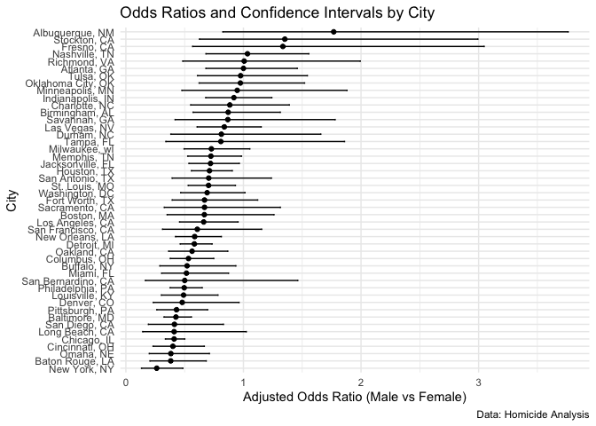

Homework 6
================
Hanchuan Chen
2024-11-26

``` r
library(tidyverse)
```

## Problem 2

### Import data and create variable “city_state”

### Create binary variable “solved” indicating whether the homicide is solved

### Omit 4 city state

### limit race only to black and white

### Clean Unknown victim_age and convert to numeric

``` r
homicide_df = 
  read_csv("./data/homicide-data.csv") |> 
  janitor::clean_names() |> 
  mutate(city_state = paste(city, state, sep=", ")) |> 
  mutate(solved = if_else(disposition == "Closed by arrest", 1, 0)) |> 
  filter(!(city_state %in% c("Dallas, TX", "Phoenix, AZ", "Kansas City, MO", "Tulsa, AL"))) |> 
  filter(victim_race %in% c("Black", "White")) |> 
  filter(victim_age != "Unknown",
         victim_sex != "Unknown") |> 
  mutate(victim_age = as.numeric(victim_age))
```

    ## Rows: 52179 Columns: 12
    ## ── Column specification ────────────────────────────────────────────────────────
    ## Delimiter: ","
    ## chr (9): uid, victim_last, victim_first, victim_race, victim_age, victim_sex...
    ## dbl (3): reported_date, lat, lon
    ## 
    ## ℹ Use `spec()` to retrieve the full column specification for this data.
    ## ℹ Specify the column types or set `show_col_types = FALSE` to quiet this message.

#### Logisic regression for Baltimore, MD

``` r
#filter the city Baltimore
baltimore_df = 
  homicide_df |> 
  filter(city_state == "Baltimore, MD")

#Perform Logistic regression
fit_logistic = 
  baltimore_df |> 
  glm(solved ~ victim_age + victim_race + victim_sex, data = _, family = binomial())
```

#### Tidy logistic regression

``` r
tidy_logistic = 
  fit_logistic |> 
  broom::tidy(conf.int = TRUE) |> 
  mutate(OR = exp(estimate),
         conf.low = exp(conf.low),
         conf.high = exp(conf.high)) |>
  select(term, log_OR = estimate, OR, p.value, conf.low, conf.high) |> 
  knitr::kable(digits = 3)

tidy_logistic
```

| term             | log_OR |    OR | p.value | conf.low | conf.high |
|:-----------------|-------:|------:|--------:|---------:|----------:|
| (Intercept)      |  0.310 | 1.363 |   0.070 |    0.976 |     1.911 |
| victim_age       | -0.007 | 0.993 |   0.043 |    0.987 |     1.000 |
| victim_raceWhite |  0.842 | 2.320 |   0.000 |    1.650 |     3.276 |
| victim_sexMale   | -0.854 | 0.426 |   0.000 |    0.324 |     0.558 |

From the table, homicides in which the victim is male are significantly
less like to be resolved than those in which the victim is female.

#### Run glm for each cities

``` r
city_result = 
  homicide_df |> 
  nest(data = -city_state) |> 
  mutate(
    model = map(data, \(df) glm(solved ~ victim_age + victim_sex + victim_race,
                            family = binomial(), data = df)),
    tidy_logistic = map(model, ~ broom::tidy(.x, conf.int = TRUE, exponentiate = TRUE))) |> 
  unnest(tidy_logistic) |> 
  filter(term == "victim_sexMale")

city_result |> 
  select(city_state, OR = estimate, conf.low, conf.high) |> 
  knitr::kable(digits = 3)
```

| city_state         |    OR | conf.low | conf.high |
|:-------------------|------:|---------:|----------:|
| Albuquerque, NM    | 1.767 |    0.825 |     3.762 |
| Atlanta, GA        | 1.000 |    0.680 |     1.458 |
| Baltimore, MD      | 0.426 |    0.324 |     0.558 |
| Baton Rouge, LA    | 0.381 |    0.204 |     0.684 |
| Birmingham, AL     | 0.870 |    0.571 |     1.314 |
| Boston, MA         | 0.667 |    0.351 |     1.260 |
| Buffalo, NY        | 0.521 |    0.288 |     0.936 |
| Charlotte, NC      | 0.884 |    0.551 |     1.391 |
| Chicago, IL        | 0.410 |    0.336 |     0.501 |
| Cincinnati, OH     | 0.400 |    0.231 |     0.667 |
| Columbus, OH       | 0.532 |    0.377 |     0.748 |
| Denver, CO         | 0.479 |    0.233 |     0.962 |
| Detroit, MI        | 0.582 |    0.462 |     0.734 |
| Durham, NC         | 0.812 |    0.382 |     1.658 |
| Fort Worth, TX     | 0.669 |    0.394 |     1.121 |
| Fresno, CA         | 1.335 |    0.567 |     3.048 |
| Houston, TX        | 0.711 |    0.557 |     0.906 |
| Indianapolis, IN   | 0.919 |    0.678 |     1.241 |
| Jacksonville, FL   | 0.720 |    0.536 |     0.965 |
| Las Vegas, NV      | 0.837 |    0.606 |     1.151 |
| Long Beach, CA     | 0.410 |    0.143 |     1.024 |
| Los Angeles, CA    | 0.662 |    0.457 |     0.954 |
| Louisville, KY     | 0.491 |    0.301 |     0.784 |
| Memphis, TN        | 0.723 |    0.526 |     0.984 |
| Miami, FL          | 0.515 |    0.304 |     0.873 |
| Milwaukee, wI      | 0.727 |    0.495 |     1.054 |
| Minneapolis, MN    | 0.947 |    0.476 |     1.881 |
| Nashville, TN      | 1.034 |    0.681 |     1.556 |
| New Orleans, LA    | 0.585 |    0.422 |     0.812 |
| New York, NY       | 0.262 |    0.133 |     0.485 |
| Oakland, CA        | 0.563 |    0.364 |     0.867 |
| Oklahoma City, OK  | 0.974 |    0.623 |     1.520 |
| Omaha, NE          | 0.382 |    0.199 |     0.711 |
| Philadelphia, PA   | 0.496 |    0.376 |     0.650 |
| Pittsburgh, PA     | 0.431 |    0.263 |     0.696 |
| Richmond, VA       | 1.006 |    0.483 |     1.994 |
| San Antonio, TX    | 0.705 |    0.393 |     1.238 |
| Sacramento, CA     | 0.669 |    0.326 |     1.314 |
| Savannah, GA       | 0.867 |    0.419 |     1.780 |
| San Bernardino, CA | 0.500 |    0.166 |     1.462 |
| San Diego, CA      | 0.413 |    0.191 |     0.830 |
| San Francisco, CA  | 0.608 |    0.312 |     1.155 |
| St. Louis, MO      | 0.703 |    0.530 |     0.932 |
| Stockton, CA       | 1.352 |    0.626 |     2.994 |
| Tampa, FL          | 0.808 |    0.340 |     1.860 |
| Tulsa, OK          | 0.976 |    0.609 |     1.544 |
| Washington, DC     | 0.691 |    0.466 |     1.014 |

#### Create a plot of ORs and CIs for each city

``` r
or_plot <- city_result |> 
  filter(term == "victim_sexMale") |>  # Filter for male vs female victim odds ratio
  ggplot(aes(x = reorder(city_state, estimate), y = estimate)) + 
  geom_point() +  # Add points for the odds ratios
  geom_errorbar(aes(ymin = conf.low, ymax = conf.high), width = 0.2) +  # Add error bars for CIs
  coord_flip() +  # Flip coordinates for better readability
  labs(
    x = "City",
    y = "Adjusted Odds Ratio (Male vs Female)",
    title = "Odds Ratios and Confidence Intervals by City",
    caption = "Data: Homicide Analysis"
  ) +
  theme_minimal()

# Display the plot
print(or_plot)
```

<!-- -->
