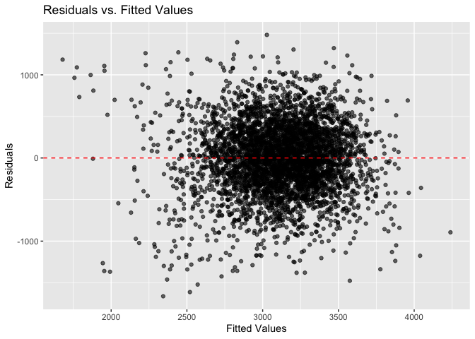
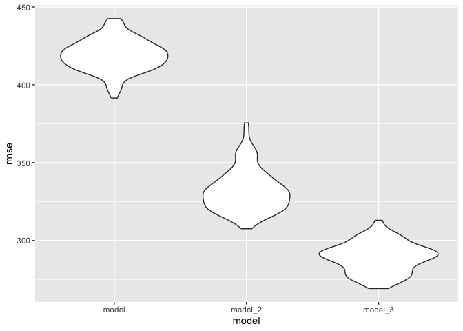

Homework 6
================
Hanchuan Chen
2024-11-26

``` r
library(tidyverse)
library(modelr)
```

## Problem 2

#### Import data and create variable “city_state”

#### Create binary variable “solved” indicating whether the homicide is solved

#### Omit 4 city state

#### limit race only to black and white

#### Clean Unknown victim_age and convert to numeric

``` r
homicide_df = 
  read_csv("./data/homicide-data.csv") |> 
  janitor::clean_names() |> 
  mutate(city_state = paste(city, state, sep=", ")) |> 
  mutate(solved = if_else(disposition == "Closed by arrest", 1, 0)) |> 
  filter(!(city_state %in% c("Dallas, TX", "Phoenix, AZ", "Kansas City, MO", "Tulsa, AL"))) |> 
  filter(victim_race %in% c("Black", "White")) |> 
  filter(victim_age != "Unknown",
         victim_sex != "Unknown") |> 
  mutate(victim_age = as.numeric(victim_age))
```

    ## Rows: 52179 Columns: 12
    ## ── Column specification ────────────────────────────────────────────────────────
    ## Delimiter: ","
    ## chr (9): uid, victim_last, victim_first, victim_race, victim_age, victim_sex...
    ## dbl (3): reported_date, lat, lon
    ## 
    ## ℹ Use `spec()` to retrieve the full column specification for this data.
    ## ℹ Specify the column types or set `show_col_types = FALSE` to quiet this message.

#### Logisic regression for Baltimore, MD

``` r
#filter the city Baltimore
baltimore_df = 
  homicide_df |> 
  filter(city_state == "Baltimore, MD")

#Perform Logistic regression
fit_logistic = 
  baltimore_df |> 
  glm(solved ~ victim_age + victim_race + victim_sex, data = _, family = binomial())
```

#### Tidy logistic regression

``` r
tidy_logistic = 
  fit_logistic |> 
  broom::tidy(conf.int = TRUE) |> 
  mutate(OR = exp(estimate),
         conf.low = exp(conf.low),
         conf.high = exp(conf.high)) |>
  select(term, log_OR = estimate, OR, p.value, conf.low, conf.high) |> 
  knitr::kable(digits = 3)

tidy_logistic
```

| term             | log_OR |    OR | p.value | conf.low | conf.high |
|:-----------------|-------:|------:|--------:|---------:|----------:|
| (Intercept)      |  0.310 | 1.363 |   0.070 |    0.976 |     1.911 |
| victim_age       | -0.007 | 0.993 |   0.043 |    0.987 |     1.000 |
| victim_raceWhite |  0.842 | 2.320 |   0.000 |    1.650 |     3.276 |
| victim_sexMale   | -0.854 | 0.426 |   0.000 |    0.324 |     0.558 |

From the table, homicides in which the victim is male are significantly
less like to be resolved than those in which the victim is female.

#### Run glm for each cities

``` r
city_result = 
  homicide_df |> 
  nest(data = -city_state) |> 
  mutate(
    model = map(data, \(df) glm(solved ~ victim_age + victim_sex + victim_race,
                            family = binomial(), data = df)),
    tidy_logistic = map(model, ~ broom::tidy(.x, conf.int = TRUE, exponentiate = TRUE))) |> 
  unnest(tidy_logistic) |> 
  filter(term == "victim_sexMale")

city_result |> 
  select(city_state, OR = estimate, conf.low, conf.high) |> 
  knitr::kable(digits = 3)
```

| city_state         |    OR | conf.low | conf.high |
|:-------------------|------:|---------:|----------:|
| Albuquerque, NM    | 1.767 |    0.825 |     3.762 |
| Atlanta, GA        | 1.000 |    0.680 |     1.458 |
| Baltimore, MD      | 0.426 |    0.324 |     0.558 |
| Baton Rouge, LA    | 0.381 |    0.204 |     0.684 |
| Birmingham, AL     | 0.870 |    0.571 |     1.314 |
| Boston, MA         | 0.667 |    0.351 |     1.260 |
| Buffalo, NY        | 0.521 |    0.288 |     0.936 |
| Charlotte, NC      | 0.884 |    0.551 |     1.391 |
| Chicago, IL        | 0.410 |    0.336 |     0.501 |
| Cincinnati, OH     | 0.400 |    0.231 |     0.667 |
| Columbus, OH       | 0.532 |    0.377 |     0.748 |
| Denver, CO         | 0.479 |    0.233 |     0.962 |
| Detroit, MI        | 0.582 |    0.462 |     0.734 |
| Durham, NC         | 0.812 |    0.382 |     1.658 |
| Fort Worth, TX     | 0.669 |    0.394 |     1.121 |
| Fresno, CA         | 1.335 |    0.567 |     3.048 |
| Houston, TX        | 0.711 |    0.557 |     0.906 |
| Indianapolis, IN   | 0.919 |    0.678 |     1.241 |
| Jacksonville, FL   | 0.720 |    0.536 |     0.965 |
| Las Vegas, NV      | 0.837 |    0.606 |     1.151 |
| Long Beach, CA     | 0.410 |    0.143 |     1.024 |
| Los Angeles, CA    | 0.662 |    0.457 |     0.954 |
| Louisville, KY     | 0.491 |    0.301 |     0.784 |
| Memphis, TN        | 0.723 |    0.526 |     0.984 |
| Miami, FL          | 0.515 |    0.304 |     0.873 |
| Milwaukee, wI      | 0.727 |    0.495 |     1.054 |
| Minneapolis, MN    | 0.947 |    0.476 |     1.881 |
| Nashville, TN      | 1.034 |    0.681 |     1.556 |
| New Orleans, LA    | 0.585 |    0.422 |     0.812 |
| New York, NY       | 0.262 |    0.133 |     0.485 |
| Oakland, CA        | 0.563 |    0.364 |     0.867 |
| Oklahoma City, OK  | 0.974 |    0.623 |     1.520 |
| Omaha, NE          | 0.382 |    0.199 |     0.711 |
| Philadelphia, PA   | 0.496 |    0.376 |     0.650 |
| Pittsburgh, PA     | 0.431 |    0.263 |     0.696 |
| Richmond, VA       | 1.006 |    0.483 |     1.994 |
| San Antonio, TX    | 0.705 |    0.393 |     1.238 |
| Sacramento, CA     | 0.669 |    0.326 |     1.314 |
| Savannah, GA       | 0.867 |    0.419 |     1.780 |
| San Bernardino, CA | 0.500 |    0.166 |     1.462 |
| San Diego, CA      | 0.413 |    0.191 |     0.830 |
| San Francisco, CA  | 0.608 |    0.312 |     1.155 |
| St. Louis, MO      | 0.703 |    0.530 |     0.932 |
| Stockton, CA       | 1.352 |    0.626 |     2.994 |
| Tampa, FL          | 0.808 |    0.340 |     1.860 |
| Tulsa, OK          | 0.976 |    0.609 |     1.544 |
| Washington, DC     | 0.691 |    0.466 |     1.014 |

#### Create a plot of ORs and CIs for each city

``` r
or_plot <- city_result |> 
  filter(term == "victim_sexMale") |>  
  ggplot(aes(x = reorder(city_state, estimate), y = estimate)) + 
  geom_point() +  
  geom_errorbar(aes(ymin = conf.low, ymax = conf.high), width = 0.2) +  
  coord_flip() +  
  labs(
    x = "City",
    y = "Adjusted Odds Ratio (Male vs Female)",
    title = "Odds Ratios and Confidence Intervals by City",
    caption = "Data: Homicide Analysis"
  ) +
  theme_minimal()

print(or_plot)
```

<!-- -->

The majority of cities show odds ratios below 1, indicating that
homicides involving male victims are generally less likely to be solved
compared to female victims. Also wide confidence intervals in some
cities suggest uncertainty in the estimates, possibly due to small
sample sizes.

## Problem 3

#### Load and clean data

In this dataset, there are 4 variables are categorical and need to be
transformed to factor. Then I checked missing value and dropped them
(there is no missing value).

``` r
birthweight_df = 
  read_csv("./data/birthweight.csv") |> 
  janitor::clean_names() |> 
  mutate(
    babysex = as.factor(babysex),
    frace = as.factor(frace),
    malform = as.factor(malform),
    mrace = as.factor(mrace)
  ) |> 
  drop_na()
```

    ## Rows: 4342 Columns: 20
    ## ── Column specification ────────────────────────────────────────────────────────
    ## Delimiter: ","
    ## dbl (20): babysex, bhead, blength, bwt, delwt, fincome, frace, gaweeks, malf...
    ## 
    ## ℹ Use `spec()` to retrieve the full column specification for this data.
    ## ℹ Specify the column types or set `show_col_types = FALSE` to quiet this message.

#### Fit regression model

By real life experience, Baby sex, Gestational weeks (gaweeks), weight
gain during pregnancy (wtgain), pre-pregnancy BMI (ppbmi), race of
parents, maternal height (mheight) and weight (delwt), and some smoking
levels (smoken) might be influential, so I add them as predictors.

``` r
# Fit the regression model
model = lm(bwt ~ babysex + gaweeks + wtgain + ppbmi + frace + mrace + smoken + mheight + delwt, data = birthweight_df)

model |> 
  broom::tidy() |> 
  knitr::kable(digits = 3)
```

| term        |  estimate | std.error | statistic | p.value |
|:------------|----------:|----------:|----------:|--------:|
| (Intercept) | -2486.915 |  1011.136 |    -2.460 |   0.014 |
| babysex2    |   -87.642 |    12.769 |    -6.864 |   0.000 |
| gaweeks     |    52.840 |     2.084 |    25.354 |   0.000 |
| wtgain      |    13.566 |     4.014 |     3.380 |   0.001 |
| ppbmi       |    45.425 |    22.885 |     1.985 |   0.047 |
| frace2      |  -122.340 |    70.866 |    -1.726 |   0.084 |
| frace3      |   -47.423 |   106.568 |    -0.445 |   0.656 |
| frace4      |   -86.521 |    68.687 |    -1.260 |   0.208 |
| frace8      |   -13.757 |   113.875 |    -0.121 |   0.904 |
| mrace2      |  -165.933 |    70.798 |    -2.344 |   0.019 |
| mrace3      |   -27.846 |   110.521 |    -0.252 |   0.801 |
| mrace4      |   -19.044 |    69.362 |    -0.275 |   0.784 |
| smoken      |   -11.943 |     0.892 |   -13.394 |   0.000 |
| mheight     |    47.845 |    15.837 |     3.021 |   0.003 |
| delwt       |    -3.939 |     3.972 |    -0.992 |   0.321 |

#### Plot model residuals

``` r
# Add predictions and residuals to the dataset
birthweight_df =
  birthweight_df |> 
  modelr::add_predictions(model, var = "predicted_bwt") |> 
  modelr::add_residuals(model, var = "residuals")

# Plot residuals vs. fitted values
ggplot(birthweight_df, aes(x = predicted_bwt, y = residuals)) +
  geom_point(alpha = 0.6) +
  geom_hline(yintercept = 0, linetype = "dashed", color = "red") +
  labs(
    title = "Residuals vs. Fitted Values",
    x = "Fitted Values",
    y = "Residuals"
  )
```

<!-- -->

#### Build another 2 models

``` r
model_2 = lm(bwt ~ blength + gaweeks, data = birthweight_df)
model_3 = lm(bwt ~ bhead * blength * babysex, data = birthweight_df)
```

#### Cross-validation and the avg RMSE results

``` r
set.seed(42)
cv_df = 
  crossv_mc(birthweight_df, 100) |> 
  mutate(
    train = map(train, as_tibble),
    test = map(test, as_tibble)
  )

cv_df = 
  cv_df |> 
  mutate(
    model = map(train, \(df) lm(bwt ~ babysex + gaweeks + wtgain + ppbmi + frace + 
                                  mrace + smoken + mheight + delwt, data = df)),
    model_2 = map(train, \(df) lm(bwt ~ blength + gaweeks, data = df)),
    model_3 = map(train, \(df) lm(bwt ~ bhead * blength * babysex, data = df))
  ) |> 
  mutate(
    rmse_model = map2_dbl(model, test, \(mod, df) rmse(model = mod, data = df)),
    rmse_model_2 = map2_dbl(model_2, test, \(mod, df) rmse(model = mod, data = df)),
    rmse_model_3 = map2_dbl(model_3, test, \(mod, df) rmse(model = mod, data = df))
  )

cv_summary =
  cv_df |> 
  summarize(
    avg_rmse_model = mean(rmse_model),
    avg_rmse_model_2 = mean(rmse_model_2),
    avg_rmse_model_3 = mean(rmse_model_3)
  )

cv_summary
```

    ## # A tibble: 1 × 3
    ##   avg_rmse_model avg_rmse_model_2 avg_rmse_model_3
    ##            <dbl>            <dbl>            <dbl>
    ## 1           419.             332.             289.

#### Plot the error distribution

``` r
cv_df |> 
  select(starts_with("rmse")) |> 
  pivot_longer(
    everything(),
    names_to = "model", 
    values_to = "rmse",
    names_prefix = "rmse_") |> 
  mutate(model = fct_inorder(model)) |> 
  ggplot(aes(x = model, y = rmse)) + geom_violin()
```

<!-- -->

By setting seed 42, model 3 with 3-interactions have the lowest RMSE and
full model have the highest. However, when I change seed and the results
also changed, which means sampling will make influence on final RMSE
results.
